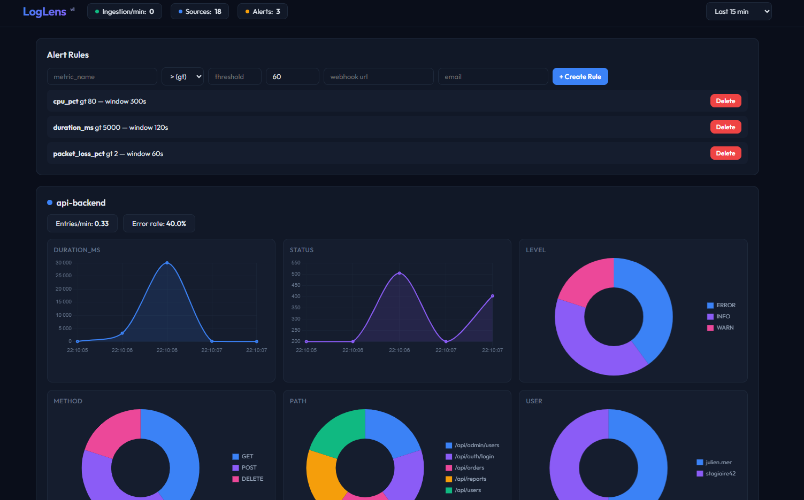

<div align="center">

<!-- ═══════════════════════════════════════════════════════════ -->
<!-- BANNER SVG WAVE -->
<!-- ═══════════════════════════════════════════════════════════ -->


<!-- ═══════════════════════════════════════════════════════════ -->
<!-- ANIMATED TITLE -->
<!-- ═══════════════════════════════════════════════════════════ -->


<br>

<!-- ═══════════════════════════════════════════════════════════ -->
<!-- TAGLINE -->
<!-- ═══════════════════════════════════════════════════════════ -->


<br><br>

<!-- ═══════════════════════════════════════════════════════════ -->
<!-- TECH BADGES -->
<!-- ═══════════════════════════════════════════════════════════ -->
<a href="https://python.org"></a>
<a href="https://fastapi.tiangolo.com"></a>
<a href="https://sqlite.org"></a>
<a href="https://developer.mozilla.org"></a>
<a href="https://www.chartjs.org"></a>
<a href="LICENSE"></a>

<br><br>

<!-- ═══════════════════════════════════════════════════════════ -->
<!-- STATS BADGES (style dashboard) -->
<!-- ═══════════════════════════════════════════════════════════ -->

&nbsp;

&nbsp;

&nbsp;

&nbsp;


<br><br>

<!-- ═══════════════════════════════════════════════════════════ -->
<!-- SCREENSHOT -->
<!-- ═══════════════════════════════════════════════════════════ -->


<br>

<!-- ═══════════════════════════════════════════════════════════ -->
<!-- SEPARATOR -->
<!-- ═══════════════════════════════════════════════════════════ -->


</div>

## Fonctionnalités

### Ingestion multi-format avec détection automatique

LogLens détecte et parse automatiquement les formats suivants sans aucune configuration :

| Format | Exemple | Extraction |
|--------|---------|------------|
| **JSON / JSONL** | `{"level":"ERROR","message":"timeout","duration":3.5}` | Champs numériques + string |
| **Syslog** | `Feb 26 14:30:01 srv01 nginx[1234]: request failed` | Host, process, PID, message |
| **Nginx access log** | `192.168.1.1 - - [26/Feb/2026:14:30:01] "GET /api HTTP/1.1" 200 1234` | IP, method, path, status, bytes, response_time |
| **CSV / TSV** | Détection automatique du séparateur via `csv.Sniffer` | Toutes les colonnes |
| **Plain text** | Tout le reste | Timestamps ISO, nombres, level |

Chaque entrée est automatiquement enrichie :
- **Timestamp** normalisé (8 formats supportés)
- **Level** déduit par analyse du contenu (ERROR, WARN, INFO, DEBUG)
- **Métriques numériques** extraites et indexées
- **Catégories string** extraites et comptabilisées

### Système d'alertes

- Règles configurables : métrique + condition (`gt`, `lt`, `eq`) + seuil + fenêtre temporelle
- Boucle de vérification toutes les 30 secondes
- Notifications par **webhook** (JSON POST) et/ou **email** (SMTP)
- Historique des alertes déclenchées

### Dashboard temps réel

- **Line charts** pour chaque métrique numérique par source
- **Pie charts** pour la distribution des catégories
- **Log viewer** coloré par level (ERROR rouge, WARN orange, INFO vert, DEBUG gris)
- **Stats globales** : ingestion/min, sources actives, alertes actives
- Rafraîchissement automatique toutes les 10 secondes
- Sélecteur de plage temporelle : 5min, 15min, 1h, 6h, 24h

### API REST

| Méthode | Endpoint | Description |
|---------|----------|-------------|
| `POST` | `/api/ingest?source=nom` | Ingestion de logs (JSON, texte, CSV) |
| `GET` | `/api/sources` | Liste des sources détectées |
| `GET` | `/api/metrics?source=X&from=T1&to=T2` | Séries temporelles des métriques |
| `GET` | `/api/categories?source=X` | Distribution des catégories |
| `GET` | `/api/logs?source=X&level=ERROR&limit=100` | Consultation des logs |
| `GET` | `/api/stats` | Statistiques globales |
| `POST` | `/api/alerts/rules` | Création d'une règle d'alerte |
| `DELETE` | `/api/alerts/rules/{id}` | Suppression d'une règle |
| `GET` | `/api/alerts` | Règles et historique des alertes |

---

## Installation

```bash
pip install fastapi uvicorn
```

## Lancement

```bash
python main.py
```

```
 _                _
| |    ___   __ _| |    ___ _ __  ___
| |   / _ \ / _` | |   / _ \ '_ \/ __|
| |__| (_) | (_| | |__|  __/ | | \__ \
|_____\___/ \__, |_____\___|_| |_|___/
            |___/

LogLens running at http://localhost:8000
```

La base SQLite `loglens.db` est créée automatiquement au premier lancement.

---

## Utilisation

### Envoyer des logs JSON

```bash
curl -X POST http://localhost:8000/api/ingest?source=mon-app \
  -H "Content-Type: application/json" \
  -d '{"level":"ERROR","message":"Connection timeout","duration_ms":3500}'
```

### Envoyer des logs texte (syslog, nginx, plain)

```bash
# Pipe direct depuis un fichier de logs
cat /var/log/nginx/access.log | curl -X POST http://localhost:8000/api/ingest?source=nginx \
  -H "Content-Type: text/plain" --data-binary @-
```

### Envoyer du CSV

```bash
curl -X POST http://localhost:8000/api/ingest?source=metrics \
  -H "Content-Type: text/plain" \
  -d 'timestamp,level,message,response_time
2026-02-26T14:00:00,INFO,request ok,120
2026-02-26T14:00:01,ERROR,timeout,3500'
```

### Créer une alerte

```bash
# Alerte si response_time > 2000ms sur les 60 dernières secondes
curl -X POST http://localhost:8000/api/alerts/rules \
  -H "Content-Type: application/json" \
  -d '{
    "metric_name": "response_time",
    "condition": "gt",
    "threshold": 2000,
    "window_seconds": 60,
    "webhook_url": "https://hooks.slack.com/services/xxx"
  }'
```

---

## Architecture

```
LogLens (5 fichiers, ~550 lignes)
│
├── main.py          # FastAPI app, API REST, SQLite, boucle d'alertes
├── detector.py      # Détection de format et parsing multi-format
├── extractor.py     # Extraction de métriques et catégories
├── alerts.py        # Moteur d'alertes, webhooks, email
└── static/
    └── index.html   # Dashboard (vanilla JS + Chart.js)
```

### Schéma de la base

```
log_entries          metrics              categories          alert_rules         alert_history
├── id               ├── id               ├── id              ├── id              ├── id
├── timestamp        ├── log_entry_id     ├── log_entry_id    ├── metric_name     ├── rule_id
├── source           ├── metric_name      ├── category_name   ├── condition       ├── triggered_at
├── level            ├── metric_value     ├── category_value  ├── threshold       ├── metric_value
├── message          └── timestamp        └── timestamp       ├── window_seconds  └── notified
├── raw_line                                                  ├── webhook_url
├── format_detected                                           ├── email
└── created_at                                                └── enabled
```

### Principes de conception

- **Zéro configuration** : envoie des logs, LogLens détecte le format
- **Zéro dépendance externe** : SQLite embarqué, pas de Redis, pas de Kafka, pas d'Elasticsearch
- **Thread-safe** : DB_LOCK sur toutes les opérations SQLite, WAL mode pour la concurrence lecture/écriture
- **Autonome** : un seul `python main.py` et c'est en prod

---

## Licence

MIT

---

**JMerConsulting** — [github.com/julienmerconsulting](https://github.com/julienmerconsulting)
